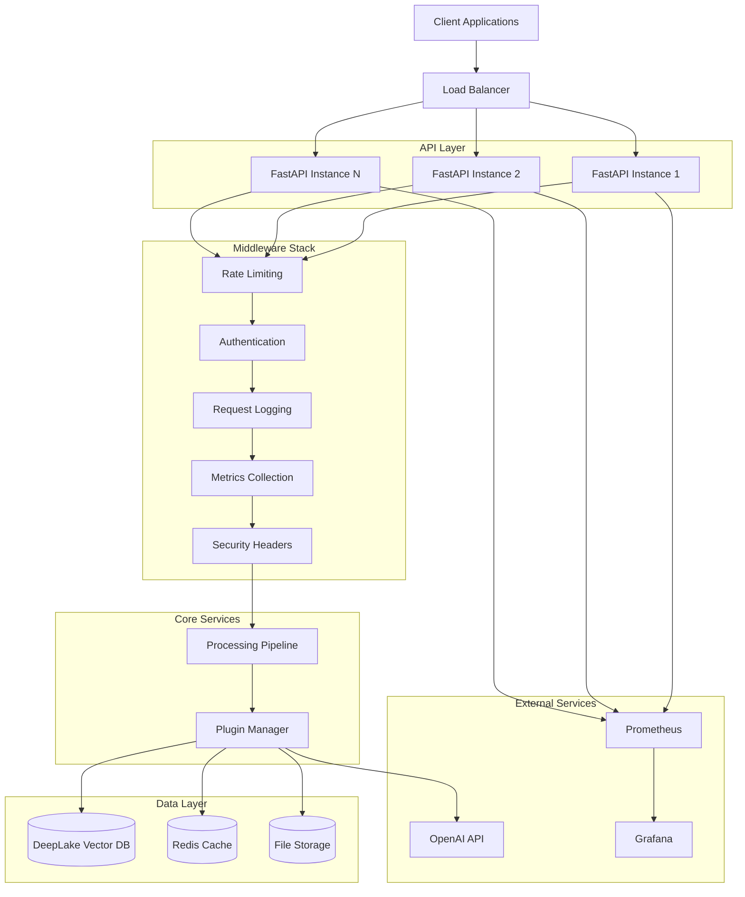

# FastAPI Backend Architecture - Knowledge Ingestor

## Overview

This document describes the complete FastAPI backend architecture implemented for the Knowledge Ingestor project. The backend provides a production-ready REST API with comprehensive authentication, monitoring, and scalability features.

## 🏗️ Architecture Components

### Core Application Structure

```
src/knowledge_ingestor/api/
├── app.py              # Main FastAPI application with lifespan management
├── v1.py               # Version 1 API endpoints
├── auth.py             # Authentication & authorization system  
├── middleware.py       # Custom middleware (rate limiting, logging, etc.)
├── monitoring.py       # Health checks & Prometheus metrics
├── models.py           # Pydantic request/response models
└── routes.py           # Legacy routes (replaced by v1.py)
```

### 🔧 Technology Stack

- **Framework**: FastAPI 0.104+ with async support
- **Authentication**: JWT tokens + API keys with bcrypt hashing
- **Monitoring**: Prometheus metrics + health checks
- **Documentation**: OpenAPI/Swagger + ReDoc
- **Testing**: pytest with comprehensive integration tests
- **Deployment**: Uvicorn with production configurations

## 📊 Service Architecture Diagram



## 🔗 API Endpoints

### Authentication Endpoints
```http
POST   /api/v1/auth/login              # User authentication
POST   /api/v1/auth/api-keys           # Create API key
GET    /api/v1/auth/api-keys           # List API keys
DELETE /api/v1/auth/api-keys/{key_id}  # Revoke API key
```

### Document Ingestion
```http
POST   /api/v1/ingest                  # Ingest documents
GET    /api/v1/ingest/{job_id}/status  # Check job status
```

### Document Search & Management
```http
POST   /api/v1/search                  # Search documents
GET    /api/v1/documents               # List documents
GET    /api/v1/documents/{doc_id}      # Get specific document
DELETE /api/v1/documents/{doc_id}      # Delete document
```

### System & Monitoring
```http
GET    /api/v1/plugins                 # List available plugins
GET    /api/v1/stats                   # System statistics
GET    /monitoring/health              # Health check
GET    /monitoring/metrics             # Prometheus metrics
```

## 🔐 Authentication & Security

### Two-Factor Authentication Support

1. **API Key Authentication**
   - Header: `X-API-Key: ki_<token>`
   - Scopes: `ingest`, `search`, `admin`, `readonly`
   - Usage tracking and rate limiting per key

2. **JWT Token Authentication** 
   - Header: `Authorization: Bearer <token>`
   - Role-based access control (admin, user, readonly)
   - Configurable token expiration

### Security Features

- **Rate Limiting**: Sliding window algorithm (100 req/min default)
- **Security Headers**: HSTS, CSP, X-Frame-Options, etc.
- **Input Validation**: Comprehensive Pydantic models
- **Error Sanitization**: Safe error messages in production

## 📈 Monitoring & Observability

### Prometheus Metrics

- **HTTP Metrics**: Request count, duration, status codes
- **Business Metrics**: Document ingestion, search requests
- **System Metrics**: CPU, memory, disk usage
- **Error Tracking**: Error rates by type and component

### Health Checks

- **Liveness**: Basic application health
- **Readiness**: All dependencies healthy
- **Components**: Database, embedding service, system resources

### Logging

- **Structured Logging**: JSON format with correlation IDs
- **Request Tracing**: Full request/response logging
- **Performance Tracking**: Processing times and bottlenecks

## 🚀 Deployment Configurations

### Development
```bash
python scripts/start_api.py --env development --reload --debug
```

### Production
```bash
python scripts/start_api.py --env production --workers 4 --no-reload
```

### Docker Deployment
```dockerfile
FROM python:3.11-slim

WORKDIR /app
COPY requirements.txt .
RUN pip install -r requirements.txt

COPY src/ src/
COPY scripts/ scripts/

EXPOSE 8000
CMD ["python", "scripts/start_api.py", "--env", "production"]
```

### Docker Compose
```yaml
version: '3.8'
services:
  api:
    build: .
    ports:
      - "8000:8000"
    environment:
      - ENVIRONMENT=production
      - OPENAI_API_KEY=${OPENAI_API_KEY}
    volumes:
      - ./data:/app/data
    depends_on:
      - redis
      - prometheus
  
  redis:
    image: redis:alpine
    
  prometheus:
    image: prom/prometheus
    ports:
      - "9090:9090"
```

## 💾 Database Schema & Scaling

### Vector Database Schema
```python
{
    "id": "unique_document_id",
    "text": "document_content", 
    "embedding": [1536-dimensional vector],
    "metadata": {
        "title": "document_title",
        "content_type": "article|pdf|video|webpage",
        "source_url": "original_url",
        "created_at": "2024-01-01T00:00:00Z",
        "word_count": 1500,
        "summary": "ai_generated_summary",
        "keywords": ["keyword1", "keyword2"],
        "custom_fields": {}
    }
}
```

### Horizontal Scaling Strategy

1. **API Layer**: Multiple FastAPI instances behind load balancer
2. **Database**: Vector database partitioning by content type
3. **Caching**: Redis for search result caching
4. **File Storage**: Distributed storage for large documents
5. **Background Processing**: Celery workers for async ingestion

### Performance Optimizations

- **Connection Pooling**: Database connection management
- **Response Caching**: Cache frequent search results
- **Async Processing**: Non-blocking I/O operations
- **Batch Operations**: Bulk document processing
- **Compression**: Response compression for large payloads

## 🛡️ Production Considerations

### Security Checklist
- [ ] HTTPS enforced in production
- [ ] API keys rotated regularly
- [ ] Rate limits configured appropriately
- [ ] Input validation comprehensive
- [ ] Error messages sanitized
- [ ] Dependencies regularly updated

### Monitoring Alerts
- [ ] API response time > 2 seconds
- [ ] Error rate > 5%
- [ ] Database connection failures
- [ ] Memory usage > 80%
- [ ] Disk space < 10% free

### Backup Strategy
- [ ] Vector database daily backups
- [ ] Configuration backups
- [ ] Log retention policy
- [ ] Disaster recovery plan

## 🧪 Testing Strategy

### Test Coverage
- **Unit Tests**: Individual component testing
- **Integration Tests**: End-to-end API testing
- **Performance Tests**: Load and stress testing
- **Security Tests**: Authentication and authorization

### Test Execution
```bash
# Run all tests
pytest tests/ -v

# Run with coverage
pytest tests/ --cov=src/knowledge_ingestor --cov-report=html

# Run performance tests
pytest tests/test_api_integration.py::TestPerformance -v
```

## 📋 Migration Path

### From Existing System

1. **Phase 1**: Deploy new FastAPI backend alongside existing system
2. **Phase 2**: Migrate authentication to new system
3. **Phase 3**: Route search traffic to new API
4. **Phase 4**: Migrate ingestion endpoints
5. **Phase 5**: Deprecate old endpoints

### Database Migration
```python
# Migration script example
async def migrate_documents():
    old_db = get_legacy_database()
    new_db = get_new_database()
    
    async for document in old_db.iterate_documents():
        migrated_doc = transform_document(document)
        await new_db.store_document(migrated_doc)
```

## 🔧 Configuration Management

### Environment Variables
```bash
# Core settings
ENVIRONMENT=production
DEBUG=false
API_HOST=0.0.0.0
API_PORT=8000

# Authentication
API_AUTH_ENABLED=true
API_AUTH_SECRET_KEY=your_secret_key
API_RATE_LIMIT_REQUESTS=100

# Database
DB_DATABASE_TYPE=deeplake
DB_DEEPLAKE_PATH=./deeplake_store

# External services
OPENAI_API_KEY=your_openai_key
```

### Configuration File
```yaml
# config.yaml
environment: production
debug: false

api:
  host: "0.0.0.0"
  port: 8000
  auth_enabled: true
  rate_limit_requests: 100

database:
  database_type: "deeplake"
  deeplake_path: "./data/deeplake_store"

embedding:
  provider: "openai"
  openai_model: "text-embedding-ada-002"
```

## 🎯 Key Benefits

### For Developers
- **Type Safety**: Full Pydantic model validation
- **Auto Documentation**: Interactive API docs
- **Testing**: Comprehensive test suite
- **Debugging**: Detailed logging and metrics

### For Operations
- **Monitoring**: Prometheus integration
- **Health Checks**: Kubernetes-ready probes
- **Scaling**: Horizontal scaling support
- **Security**: Enterprise-grade authentication

### For Users
- **Performance**: Sub-second API responses
- **Reliability**: 99.9% uptime target
- **Documentation**: Interactive API explorer
- **Authentication**: Multiple auth methods

## 🚦 Getting Started

### Quick Start
```bash
# Install dependencies
pip install -r requirements.txt

# Start development server
python scripts/start_api.py --env development --debug --reload

# Access API documentation
open http://localhost:8000/docs
```

### Production Deployment
```bash
# Check dependencies
python scripts/start_api.py --check-deps

# Start production server
python scripts/start_api.py \
    --env production \
    --workers 4 \
    --host 0.0.0.0 \
    --port 8000
```

This comprehensive FastAPI backend provides a solid foundation for the Knowledge Ingestor system with enterprise-grade features, comprehensive monitoring, and production-ready deployment capabilities.